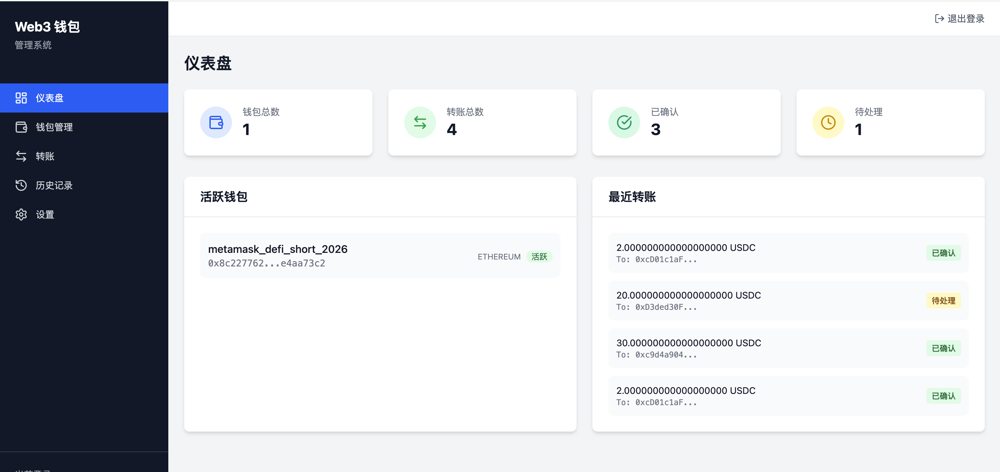
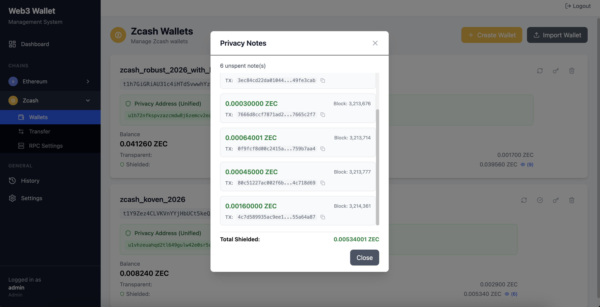
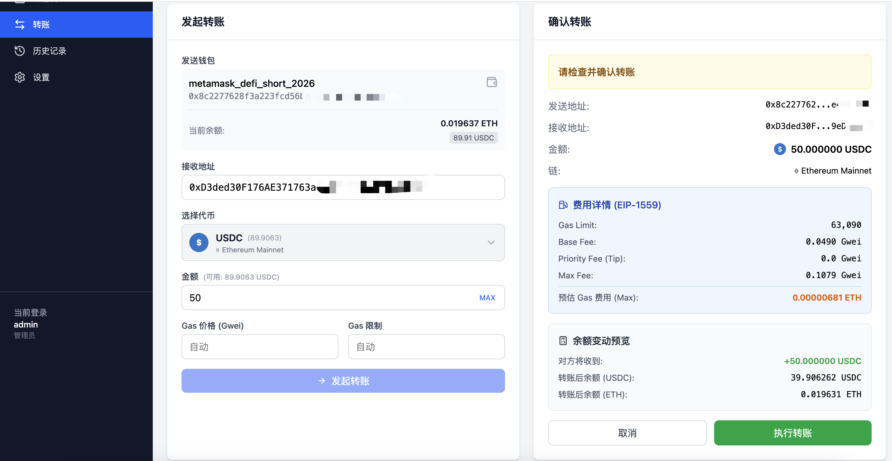
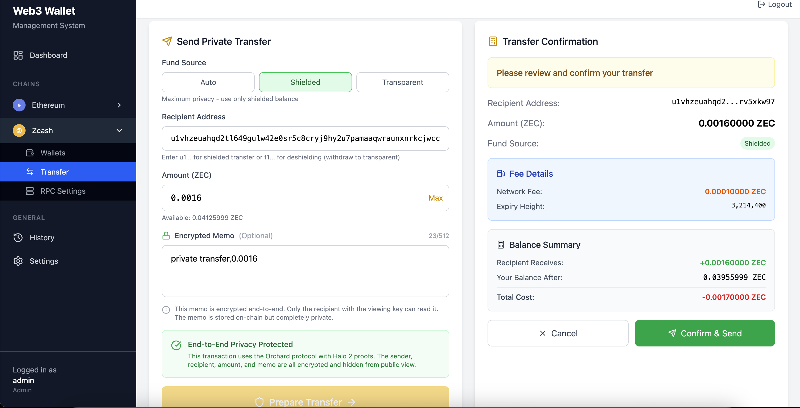
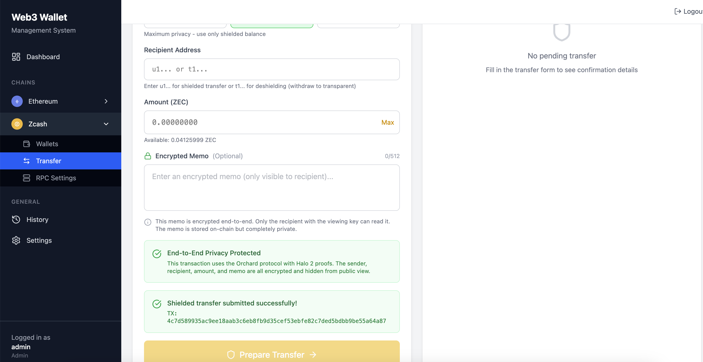
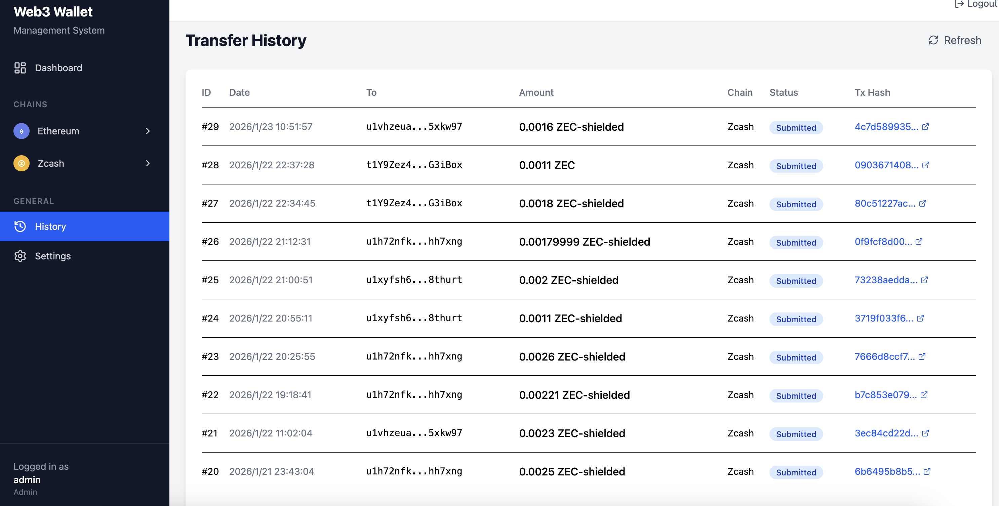
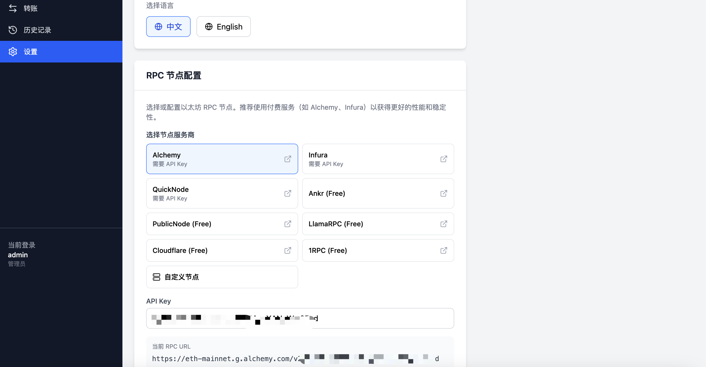

[English](README.md) | [中文](README_CN.md)

# Web3 钱包服务

一个模块化的 Web3 钱包管理服务，支持多链架构，采用 Rust 后端 + React 前端技术栈。**现已完整支持 Zcash Orchard 隐私协议。**

## 功能特性

- **钱包管理** - 创建、导入和管理多个钱包，私钥加密存储
- **多链支持** - 可扩展的多链架构（支持以太坊、Zcash）
- **代币支持** - 原生代币和 ERC20 代币（USDT、USDC、DAI、WETH）
- **Zcash 隐私** - 完整的 Orchard 协议，支持 Halo 2 零知识证明
- **四种转账模式** - 完整的 Zcash 转账类型（T→T、T→Z、Z→Z、Z→T）
- **转账管理** - 发起、执行和追踪交易，实时状态更新
- **Gas 估算** - 兼容 EIP-1559 的 Gas 费用估算
- **RPC 管理** - 动态 RPC 节点配置，支持备用节点
- **权限控制** - 管理员和操作员角色权限管理
- **国际化** - 前端多语言支持

---

## 界面预览

### 仪表盘


### Zcash 钱包管理
Zcash 钱包页面，显示统一地址、透明/隐私余额、Privacy Notes 查看器。


### 以太坊转账
ERC20 代币转账，支持 EIP-1559 Gas 估算和余额变动预览。


### Zcash 隐私转账 (Z→Z)
隐私到隐私转账，支持加密备忘录和 Halo 2 证明生成。


### 转账成功
交易提交成功，显示交易哈希。


### 转账历史
完整的转账历史记录，支持隐私交易追踪。


### RPC 节点设置
多服务商 RPC 配置，支持 Alchemy、Infura、QuickNode 等。


---

## 产品愿景与路线图

我们正在构建 **企业级 Web3 隐私金融基础设施** — 让企业可以在公链上，像使用银行系统一样，安全、私密、可控地转移资金。

### 我们正在构建什么

> **Web3 隐私金融操作系统**
>
> *"区块链世界的 Stripe + 企业资金系统 + 隐私层"*

一个企业级统一平台，使公司可以：
- 接收、存储、转移和结算数字资产
- 使用 Zcash 隐私池保护商业机密
- 使用公链获得流动性
- 控制谁可以动用资金、在什么条件下
- 生成可用于审计与合规的记录

### 2026 产品路线图

| 季度 | 重点方向 | 核心交付 |
|------|----------|----------|
| **Q1** | 企业级稳定性 | 端到端交易追踪、节点自动切换、实时监控仪表盘 |
| **Q2** | 合规与治理 | 多人审批机制、全链路审计、企业系统对接 |
| **Q3** | 高性能隐私结算 | Orchard 同步优化、大额转账、统一余额管理 |
| **Q4** | 隐私金融平台 | 企业级 SDK、多链资金平台、HSM/KMS 集成 |

### 长期愿景

到 2026 年底，我们将支撑：
- 交易所保护用户充值隐私
- OTC 平台私密结算大额交易
- 支付服务商提供默认隐私保护
- Web3 企业运行保密薪酬和资金系统

> 📄 **[查看完整路线图 (中文)](docs/product-roadmap-2026-cn.md)** | **[English](docs/product-roadmap-2026.md)**

---

## Zcash 隐私转账模式

系统实现了 **Zcash 的四种转账模式**，为隐私管理提供完整的灵活性：

### 转账模式对比

| 模式 | 发送方 | 接收方 | 隐私级别 | 使用场景 |
|------|--------|--------|----------|----------|
| **T→T** | 透明地址 | 透明地址 | 无隐私 | 标准公开交易 |
| **T→Z** | 透明地址 | 隐私地址 | 部分隐私 | 资金屏蔽化 |
| **Z→Z** | 隐私地址 | 隐私地址 | 最大隐私 | 完全隐私转账 |
| **Z→T** | 隐私地址 | 透明地址 | 部分隐私 | 交易所充值 |

### 模式详解

#### 1. 透明到透明 (T→T)

```
┌─────────────┐                    ┌─────────────┐
│  t1abc...   │ ───── ZEC ──────▶  │  t1xyz...   │
│  (发送方)   │                    │  (接收方)   │
└─────────────┘                    └─────────────┘
         链上完全公开
```

- **隐私性**: 无 - 所有细节在链上可见
- **速度**: 快速（约 75 秒确认）
- **使用场景**: 公开支付、交易所充提
- **API**: `POST /api/v1/transfers`

#### 2. 透明到隐私 (T→Z 屏蔽化)

```
┌─────────────┐                    ┌─────────────┐
│  t1abc...   │ ───── ZEC ──────▶  │  u1xyz...   │
│   透明地址  │       屏蔽化       │   隐私地址  │
└─────────────┘                    └─────────────┘
     可见                             隐藏
```

- **隐私性**: 部分 - 发送方可见，接收方隐藏
- **证明**: 生成 Halo 2 零知识证明
- **使用场景**: 将资金转入隐私池
- **API**: `POST /api/v1/transfers/orchard`，`fund_source: "Transparent"`

#### 3. 隐私到隐私 (Z→Z)

```
┌─────────────┐                    ┌─────────────┐
│  u1abc...   │ ───── ZEC ──────▶  │  u1xyz...   │
│   隐私地址  │      完全隐私      │   隐私地址  │
└─────────────┘                    └─────────────┘
     隐藏          隐藏              隐藏
              最大隐私保护
```

- **隐私性**: 最大 - 发送方、接收方、金额全部隐藏
- **证明**: 完整 Halo 2 证明（支出 + 输出）
- **备忘录**: 支持 512 字节加密备忘录
- **使用场景**: 私密支付、保密商业交易
- **API**: `POST /api/v1/transfers/orchard`，`fund_source: "Shielded"`

#### 4. 隐私到透明 (Z→T 去隐蔽化)

```
┌─────────────┐                    ┌─────────────┐
│  u1abc...   │ ───── ZEC ──────▶  │  t1xyz...   │
│   隐私地址  │      去隐蔽化      │   透明地址  │
└─────────────┘                    └─────────────┘
     隐藏                             可见
```

- **隐私性**: 部分 - 发送方隐藏，接收方可见
- **证明**: 需要 Halo 2 支出证明
- **使用场景**: 交易所充值、从隐私资金进行公开支付
- **API**: `POST /api/v1/transfers/orchard`，接收地址为透明地址

### 技术实现

Orchard 隐私系统使用：

- **Halo 2**: 递归零知识证明系统（无需可信设置）
- **承诺树**: Merkle 树追踪所有隐私 Notes
- **Nullifier**: 防止双花，同时不泄露 Note 身份
- **增量见证人**: 高效更新证明路径

```rust
// 资金来源选择
pub enum FundSource {
    Auto,         // 系统自动选择最优来源
    Shielded,     // 强制使用隐私资金 (Z→Z 或 Z→T)
    Transparent,  // 强制使用透明资金 (T→Z)
}
```

### 手续费结构 (ZIP-317)

| 操作数量 | 手续费 (ZEC) |
|---------|-------------|
| 1-2 | 0.0001 |
| 3-4 | 0.00015 |
| 5+ | 每增加一个 +0.00005 |

---

## 企业级应用场景

本系统专为企业级加密货币管理设计，具备隐私功能：

### 1. 加密货币支付网关

- **场景**: 电商平台接受 ZEC 支付
- **使用功能**:
  - 为不同商户管理多个钱包
  - T→Z 屏蔽化保护客户隐私
  - 实时余额和交易追踪
  - 支付确认 Webhook 通知

### 2. 企业资金管理系统

- **场景**: 企业财务部门管理加密资产
- **使用功能**:
  - 角色权限（管理员/操作员职责分离）
  - 合规审计日志
  - 多签工作流（发起 → 审批 → 执行）
  - 加密私钥存储，可集成 HSM

### 3. OTC 交易平台

- **场景**: 大宗加密货币场外交易
- **使用功能**:
  - Z→Z 转账保护大额交易隐私
  - 交易对手方隐私保护
  - 批量交易处理
  - RPC 故障转移保证可靠性

### 4. 隐私交易所

- **场景**: 提供隐私币支持的交易所
- **使用功能**:
  - T→Z 客户充值屏蔽化
  - Z→T 提现处理
  - 自动余额对账
  - 合规审计追踪

### 5. 跨境支付服务

- **场景**: 有隐私需求的国际汇款
- **使用功能**:
  - 多链支持（ETH 追求速度，ZEC 追求隐私）
  - 统一地址管理
  - 交易备忘录用于支付凭证
  - 多语言界面

### 6. 机构托管方案

- **场景**: 为机构客户托管加密资产
- **使用功能**:
  - 每个客户独立钱包
  - 审计员只读密钥
  - 冷热钱包分离
  - 完整的日志和报表

### 7. DeFi 协议后端

- **场景**: 需要隐私功能的 DeFi 协议
- **使用功能**:
  - 可编程交易工作流
  - 以太坊操作 Gas 优化
  - 通过 Orchard 集成隐私池
  - API 优先架构便于集成

### 部署架构

```
┌─────────────────────────────────────────────────────────────────┐
│                        企业级部署                                │
├─────────────────────────────────────────────────────────────────┤
│                                                                  │
│  ┌──────────────┐     ┌──────────────┐     ┌──────────────┐    │
│  │    前端      │     │    后端      │     │    数据库    │    │
│  │   (React)    │────▶│   (Rust)     │────▶│   (MySQL)    │    │
│  │   端口 3000  │     │   端口 8080  │     │   端口 3306  │    │
│  └──────────────┘     └──────────────┘     └──────────────┘    │
│                              │                                   │
│                              ▼                                   │
│  ┌──────────────────────────────────────────────────────────┐  │
│  │                      区块链层                             │  │
│  │  ┌─────────────┐              ┌─────────────┐            │  │
│  │  │   以太坊    │              │    Zcash    │            │  │
│  │  │  RPC 节点   │              │  RPC 节点   │            │  │
│  │  │(Geth/Infura)│              │(Zebrad/Zcashd)│           │  │
│  │  └─────────────┘              └─────────────┘            │  │
│  └──────────────────────────────────────────────────────────┘  │
│                                                                  │
└─────────────────────────────────────────────────────────────────┘
```

### 企业安全考虑

| 方面 | 实现方式 |
|------|---------|
| 密钥存储 | AES-256-GCM 静态加密 |
| 身份认证 | JWT 可配置过期时间 |
| 权限控制 | 基于角色（管理员/操作员） |
| 审计 | 完整的审计日志 |
| 网络 | 生产环境要求 HTTPS/TLS |
| 密钥管理 | 基于环境变量配置 |

---

## 技术栈

### 后端
- **Rust** + Actix-web 4
- **MySQL 5.7+** + SQLx
- **Ethers-rs** 以太坊集成
- **Orchard/Zcash crates** Zcash 隐私协议
- **Halo 2** 零知识证明系统
- **AES-256-GCM** 私钥加密
- **JWT** 身份认证

### 前端
- **React 19** + TypeScript
- **Vite** 构建工具
- **Tailwind CSS**
- **i18next** 国际化

## 项目结构

```
github_web3_wallet_service/
├── backend/                    # Rust 后端服务
│   ├── src/
│   │   ├── api/               # REST API 端点和中间件
│   │   ├── blockchain/        # 链客户端和代币定义
│   │   │   ├── ethereum/      # 以太坊客户端和 ERC20 代币
│   │   │   └── zcash/         # Zcash 客户端和 Orchard 协议
│   │   │       └── orchard/   # Halo 2 证明、Notes、见证人
│   │   ├── services/          # 业务逻辑层
│   │   ├── db/                # 数据库模型和仓储
│   │   ├── crypto/            # 加密和密码哈希
│   │   └── config/            # 配置管理
│   └── Cargo.toml
│
└── frontend/                   # React TypeScript 前端
    ├── src/
    │   ├── pages/             # 页面组件
    │   ├── components/        # 可复用 UI 组件
    │   ├── services/          # API 客户端模块
    │   └── hooks/             # 自定义 React Hooks
    └── package.json
```

## 快速开始

### 环境要求

- Rust（最新稳定版）
- Node.js 18+
- MySQL 5.7+

### 后端配置

1. 进入后端目录：
```bash
cd backend
```

2. 复制环境配置文件：
```bash
cp .env.example .env
```

3. 编辑 `.env` 文件：
```env
# 服务器配置
WEB3_SERVER__HOST=127.0.0.1
WEB3_SERVER__PORT=8080

# 数据库配置
WEB3_DATABASE__HOST=localhost
WEB3_DATABASE__PORT=3306
WEB3_DATABASE__USER=root
WEB3_DATABASE__PASSWORD=your_password
WEB3_DATABASE__NAME=web3_wallet

# JWT 配置
WEB3_JWT__SECRET=your-secure-jwt-secret-key
WEB3_JWT__EXPIRE_HOURS=24

# 安全配置（必须是 32 个字符）
WEB3_SECURITY__ENCRYPTION_KEY=uK7m2VxQ9nL3aT1aR8c26yH0uJ4bZ5wE

# 以太坊配置
WEB3_ETHEREUM__RPC_URL=https://eth.llamarpc.com
WEB3_ETHEREUM__CHAIN_ID=1

# Zcash 配置
WEB3_ZCASH__RPC_URL=http://127.0.0.1:8232
WEB3_ZCASH__RPC_USER=your_rpc_user
WEB3_ZCASH__RPC_PASSWORD=your_rpc_password
```

4. 启动后端服务：
```bash
# 开发模式
./start.sh run

# 生产模式
./start.sh run-release

# 使用 PM2
./start.sh pm2
```

### 前端配置

1. 进入前端目录：
```bash
cd frontend
```

2. 安装依赖：
```bash
npm install
```

3. 启动开发服务器：
```bash
npm run dev
```

4. 构建生产版本：
```bash
npm run build
```

### 默认账号

- **用户名：** admin
- **密码：** admin123

> **重要提示：** 生产环境请立即修改默认密码。

## API 接口

### 认证接口
| 方法 | 端点 | 描述 |
|------|------|------|
| POST | `/api/v1/auth/login` | 用户登录 |
| POST | `/api/v1/auth/logout` | 用户登出 |
| PUT | `/api/v1/auth/password` | 修改密码 |
| GET | `/api/v1/auth/me` | 获取当前用户信息 |

### 钱包接口
| 方法 | 端点 | 描述 |
|------|------|------|
| GET | `/api/v1/wallets` | 获取钱包列表 |
| POST | `/api/v1/wallets` | 创建新钱包 |
| POST | `/api/v1/wallets/import` | 导入钱包（通过私钥） |
| GET | `/api/v1/wallets/{id}` | 获取钱包详情 |
| DELETE | `/api/v1/wallets/{id}` | 删除钱包 |
| PUT | `/api/v1/wallets/{id}/activate` | 设为活跃钱包 |
| POST | `/api/v1/wallets/{id}/export-key` | 导出私钥 |
| GET | `/api/v1/wallets/balance` | 获取钱包余额 |

### 转账接口
| 方法 | 端点 | 描述 |
|------|------|------|
| GET | `/api/v1/transfers` | 获取转账记录（分页） |
| POST | `/api/v1/transfers` | 发起转账 |
| GET | `/api/v1/transfers/{id}` | 获取转账详情 |
| POST | `/api/v1/transfers/{id}/execute` | 执行待处理转账 |
| POST | `/api/v1/transfers/estimate-gas` | 估算 Gas 费用 |

### Zcash Orchard（隐私转账）
| 方法 | 端点 | 描述 |
|------|------|------|
| POST | `/api/v1/wallets/{id}/orchard/enable` | 启用 Orchard |
| GET | `/api/v1/wallets/{id}/orchard/addresses` | 获取统一地址 |
| GET | `/api/v1/wallets/{id}/orchard/balance` | 获取隐私余额 |
| GET | `/api/v1/wallets/{id}/orchard/balance/combined` | 获取综合余额 |
| GET | `/api/v1/wallets/{id}/orchard/notes` | 列出未花费 Notes |
| POST | `/api/v1/transfers/orchard` | 发起隐私转账 |
| POST | `/api/v1/transfers/orchard/{id}/execute` | 执行隐私转账 |
| GET | `/api/v1/zcash/scan/status` | 获取同步状态 |
| POST | `/api/v1/zcash/scan/sync` | 触发手动同步 |

### 设置接口
| 方法 | 端点 | 描述 |
|------|------|------|
| GET | `/api/v1/settings/rpc` | 获取当前 RPC 配置 |
| PUT | `/api/v1/settings/rpc` | 更新 RPC 配置 |
| POST | `/api/v1/settings/rpc/test` | 测试 RPC 连接 |
| GET | `/api/v1/settings/rpc/presets` | 获取 RPC 预设列表 |

### 健康检查
| 方法 | 端点 | 描述 |
|------|------|------|
| GET | `/api/v1/health` | 健康检查 |

## 安全性

- **私钥加密：** 使用 AES-256-GCM 加密存储所有私钥
- **密码哈希：** 使用 Argon2 算法保护密码安全
- **JWT 认证：** 无状态认证，可配置过期时间
- **角色权限控制：** 管理员和操作员角色拥有不同权限
- **敏感操作保护：** 导出私钥需要密码验证

### 安全最佳实践

1. 立即修改默认管理员密码
2. 使用强随机的 32 字节加密密钥
3. 使用加密安全的 JWT 密钥
4. 生产环境启用 HTTPS
5. 配置适当的数据库访问控制

## 数据库

服务启动时自动创建所需数据表：

- `users` - 用户账号和角色
- `wallets` - 钱包信息（含加密私钥）
- `transfers` - 交易历史和状态
- `audit_logs` - 安全审计日志
- `settings` - 应用配置
- `orchard_sync_state` - Zcash 区块链同步进度
- `orchard_notes` - 隐私币 Notes（含见证人数据）
- `orchard_tree_state` - 承诺树状态（用于证明生成）

## 配置说明

### 环境变量

| 变量 | 描述 | 默认值 |
|------|------|--------|
| `WEB3_SERVER__HOST` | 服务器绑定地址 | 127.0.0.1 |
| `WEB3_SERVER__PORT` | 服务器端口 | 8080 |
| `WEB3_DATABASE__HOST` | MySQL 主机 | localhost |
| `WEB3_DATABASE__PORT` | MySQL 端口 | 3306 |
| `WEB3_DATABASE__USER` | MySQL 用户名 | root |
| `WEB3_DATABASE__PASSWORD` | MySQL 密码 | - |
| `WEB3_DATABASE__NAME` | 数据库名称 | web3_wallet |
| `WEB3_JWT__SECRET` | JWT 签名密钥 | - |
| `WEB3_JWT__EXPIRE_HOURS` | Token 过期时间（小时） | 24 |
| `WEB3_SECURITY__ENCRYPTION_KEY` | 32 字节加密密钥 | - |
| `WEB3_ETHEREUM__RPC_URL` | 以太坊 RPC 节点 | - |
| `WEB3_ETHEREUM__CHAIN_ID` | 以太坊链 ID | 1 |
| `WEB3_ETHEREUM__RPC_PROXY` | RPC 代理（可选） | - |
| `WEB3_ZCASH__RPC_URL` | Zcash RPC 节点 | - |
| `WEB3_ZCASH__RPC_USER` | Zcash RPC 用户名 | - |
| `WEB3_ZCASH__RPC_PASSWORD` | Zcash RPC 密码 | - |
| `WEB3_ZCASH__RPC_PROXY` | Zcash RPC 代理（可选） | - |

### 前端配置

| 变量 | 描述 | 默认值 |
|------|------|--------|
| `VITE_API_BASE_URL` | 后端 API 地址 | http://localhost:8080/api/v1 |

## PM2 部署

后端包含 PM2 配置用于生产环境部署：

```bash
# 使用 PM2 启动
./start.sh pm2

# 查看状态
./start.sh status

# 停止服务
./start.sh pm2-stop

# 重启服务
./start.sh pm2-restart
```

## 扩展开发

### 添加新链

在 `backend/src/blockchain/traits.rs` 中实现 `ChainClient` trait：

```rust
#[async_trait]
pub trait ChainClient: Send + Sync {
    async fn get_balance(&self, address: &str) -> Result<String>;
    async fn get_token_balance(&self, address: &str, token: &str) -> Result<String>;
    async fn send_transaction(&self, tx: TransactionRequest) -> Result<String>;
    // ... 其他方法
}
```

### 添加新代币

在 `backend/src/blockchain/ethereum/tokens.rs` 中添加代币定义：

```rust
pub static SUPPORTED_TOKENS: Lazy<HashMap<&'static str, TokenInfo>> = Lazy::new(|| {
    let mut m = HashMap::new();
    m.insert("NEW_TOKEN", TokenInfo {
        address: "0x...",
        decimals: 18,
        symbol: "NEW",
    });
    m
});
```

## 日志

后端日志写入 `backend/logs/web3-wallet.log`，配置如下：
- 文件大小限制 500MB
- 保留 10 个备份文件
- 通过 `RUST_LOG` 配置日志级别

```bash
# 日志级别配置示例
RUST_LOG=info,sqlx=warn
```

## 支持项目

如果这个项目对你有帮助，欢迎支持一下：

**ETH / USDT / USDC (ERC20):** `0xD76f061DaEcfC3ddaD7902A8Ff7c47FC68b3Dc49`

## 开源协议

MIT License

## 参与贡献

1. Fork 本仓库
2. 创建功能分支 (`git checkout -b feature/amazing-feature`)
3. 提交更改 (`git commit -m '添加某个新功能'`)
4. 推送到分支 (`git push origin feature/amazing-feature`)
5. 提交 Pull Request
